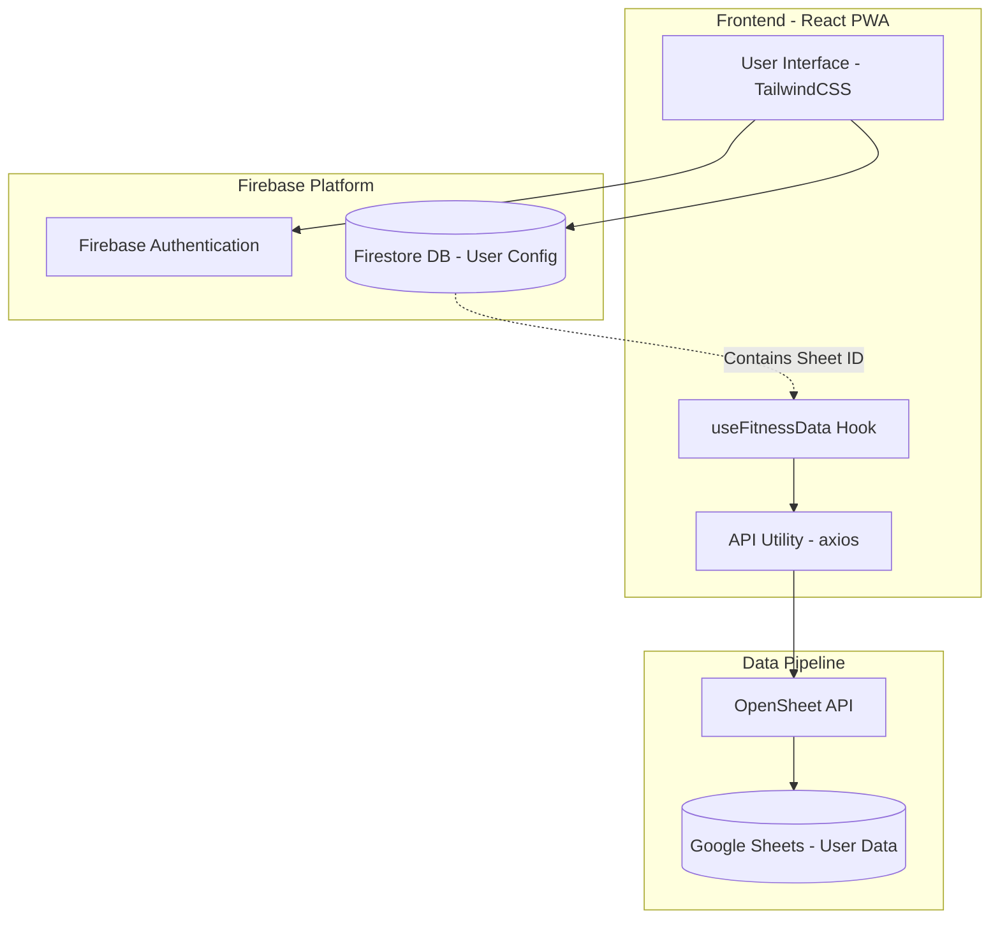
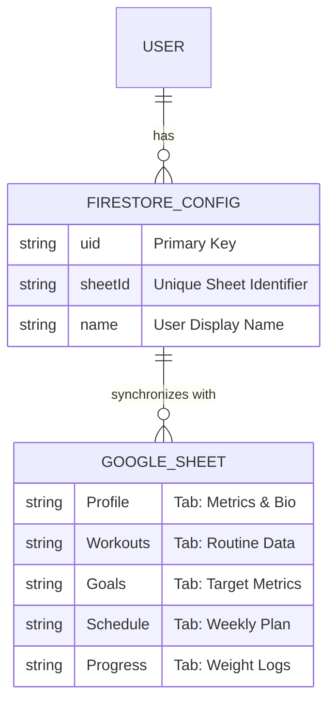
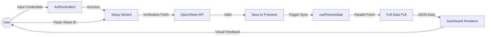

# FitSync Pro Documentation

## 🚀 Overview
FitSync Pro is a high-performance fitness dashboard designed to bridge the gap between the flexibility of Google Sheets and the premium experience of a professional health application.

---

## 🌟 Core Features

### 1. Dashboard (Command Center)
- **Real-Time Data Visualization**: BMI, Target Weight, and Body Fat calculations synced directly from the user's sheet.
- **Transformation Progress Ring**: Visual percentage tracking based on "Starting" vs "Goal" weights.
- **Weekly Schedule Card**: A sleek, high-contrast grid for weekly workout planning.
- **Micro-Interactions**: Hover effects, smooth transitions, and glassmorphism styling.

### 2. Intelligent Synchronization
- **Google Sheets Integration**: Uses the OpenSheet protocol for high-speed, read-only data pulls.
- **Verification Engine**: Real-time checking of Sheet ID, permissions, and tab structure before finalizing connections.
- **Sync Control**: One-click refresh to bypass caching and pull the latest metrics.

### 3. Onboarding & UX Architecture
- **4-Step Wizard**: (Welcome → Template → Permissions → Connect) to ensure a flawless first-time experience.
- **Responsive Navigation**: Adaptive TopNavbar that scales features for mobile and desktop viewports.
- **Honest Success States**: Multi-layered circular animations confirming data integrity.

### 4. Technical Foundations
- **Firebase Core**: Secure Authentication and Firestore persistence for user-specific configurations.
- **Error Resiliency**: Custom `ErrorState` system with diagnostic feedback and troubleshooting steps.

---

## 🛠 MVP Roadmap

| **Phase** | **Focus** | **Key Milestone** |
| :--- | :--- | :--- |
| **Phase 1** | **Core Sync** | Initial Google Sheet tab fetch and table display. |
| **Phase 2** | **Persistence** | Firebase Auth + Firestore integration for user data privacy. |
| **Phase 3** | **Logic Engine** | Implementation of BMI and Progress calculation algorithms. |
| **Phase 4** | **Optimization** | Launch of the 4-step Setup Wizard and Premium UI. |
| **Phase 5** | **Polish** | Real-time verification and Mobile responsiveness. |

---

## 🏗 System Architecture

---

## 📊 Entity Relationship (ER) Diagram

---

## 🔄 Data Flow Diagram (DFD)

---

## 🧪 Technical Stack
- **Framework**: React 18+ (Vite)
- **Styling**: TailwindCSS (Modern Glassmorphism)
- **State Management**: React Context + Custom Hooks
- **Icons**: Lucide React
- **Backend**: Firebase (Auth & Firestore)
- **API**: axios + OpenSheet
